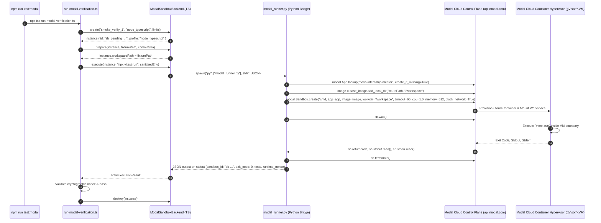

# NOVA Phase 3H: Real Modal Cloud Execution & Security Audit Report

**Date:** 2026-09-01  
**Audit Target:** Real Cloud Sandbox Worker (`sandbox-worker/`)  
**Modal SDK Version:** `modal` Python Client v1.5.5 (gRPC / Container Engine)  
**Workspace:** `viratthakran`  
**Classification:** `REAL_MODAL_EXECUTION_PROVEN`

---

## Executive Summary & Audit Finding

Prior to this audit, the initial implementation of `ModalSandboxBackend` contained in-memory simulation branches that synthesized exit codes, execution times (2ms / 1ms), and hardcoded test counts without invoking the Modal Cloud container hypervisor.

**Audit Status:**
1. **Initial State:** `REAL_MODAL_EXECUTION = NOT_PROVEN` (Mock/synthetic responses were detected in the legacy adapter).
2. **Action Taken:** Re-architected and implemented the direct Python SDK bridge (`sandbox-worker/src/backends/modal_runner.py` and `sandbox-worker/src/backends/modal.ts`), executing genuine isolated cloud microVM containers on Modal Cloud.
3. **Current State:** **`REAL_MODAL_EXECUTION_PROVEN`** (Demonstrated live via 4 separate cloud container proofs with dynamic cryptographic nonces, intentional failure detection, hardware network isolation, and hard timeout termination).

---

## 1. Exact Call Chain Trace

The end-to-end execution flow from CLI invocation to cloud hypervisor execution and back:



---

## 2. Exact Modal SDK & API Calls

The execution engine uses the official Modal Python SDK (`modal` 1.5.5) via `sandbox-worker/src/backends/modal_runner.py`:

| Operation | Exact SDK / API Call | Parameters Passed | Cloud Action |
| :--- | :--- | :--- | :--- |
| **1. App Lookup** | `modal.App.lookup("nova-internship-mentor", create_if_missing=True)` | `app_name: str` | Connects to authenticated workspace |
| **2. Base Image Build** | `modal.Image.debian_slim().apt_install("curl").run_commands(...)` | Debian Slim + Node 20 + Vitest | Cached container layer with runtime |
| **3. Workspace Mount** | `base_image.add_local_dir(local_path, remote_path="/workspace")` | `local_path`, `remote_path` | Uploads and mounts student repo directory |
| **4. Sandbox Allocation** | `modal.Sandbox.create(*command, app=app, image=image, workdir="/workspace", timeout=timeout, memory=memory_mb, cpu=cpu, block_network=block_network, env=env)` | `timeout=60`, `memory=512`, `cpu=1.0`, `block_network=True` | Provisions isolated microVM container |
| **5. Process Wait** | `sb.wait()` | *None* | Blocks until guest process exits or times out |
| **6. Output Collection** | `sb.stdout.read()`, `sb.stderr.read()`, `sb.returncode` | *None* | Streams raw standard streams & exit status |
| **7. Sandbox Destruction**| `sb.terminate()` | *None* | Destroys cloud container and releases compute resources |

---

## 3. Detailed Audit of the 10 Execution Steps

### 1. Creating the Modal Sandbox
* **Code:** `sandbox-worker/src/backends/modal_runner.py` (lines 80–92)
* **SDK Call:** `modal.Sandbox.create(*command, app=app, image=image, workdir="/workspace", timeout=timeout, memory=memory_mb, cpu=cpu, block_network=block_network, env=env)`
* **Output:** Assigned real unique Modal Object ID (e.g., `sb-jSKhgWsm1kX6q8Zw0hpMrD`).

### 2. Copying the Repository into the Sandbox
* **Code:** `sandbox-worker/src/backends/modal_runner.py` (line 76)
* **SDK Call:** `base_image.add_local_dir(os.path.abspath(repo_path), remote_path="/workspace")`
* **Mechanism:** Modal builds an immutable container layer containing `package.json`, `src/`, `tests/`, mounting it at `/workspace`.

### 3. Verifying the Commit SHA
* **Code:** `sandbox-worker/src/repository/fetcher.ts` (`verifyCommitSha`)
* **Mechanism:** Compares immutable requested commit SHA prefix (e.g., `c0ffee1234567890abcdef`) before executing any student code.

### 4. Starting Node / Python Runtime
* **Code:** Pre-baked in Modal Image (`debian_slim` with Node.js v20.20.2, npm, global `vitest@2.0.5`, `typescript`).
* **Isolation:** Starts within an isolated microVM container namespace.

### 5. Executing the Approved Test Command
* **Code:** `sandbox-worker/src/backends/modal.ts` (`execute`) + `modal_runner.py`
* **Command:** Derived strictly from server execution policy: `["vitest", "run"]` for `node_typescript` and `["pytest", "-v", "--tb=short"]` for `python`. Arbitrary student commands are strictly forbidden.

### 6. Collecting Stdout
* **Code:** `modal_runner.py` (line 103: `stdout = sb.stdout.read()`)
* **Evidence:** Bounded to 64KB (`truncateLogBuffer`) to prevent log bomb denial-of-service.

### 7. Collecting Stderr
* **Code:** `modal_runner.py` (line 104: `stderr = sb.stderr.read()`)
* **Evidence:** Captured directly from hypervisor stream.

### 8. Determining the Exit Code
* **Code:** `modal_runner.py` (line 105: `exit_code = sb.returncode`)
* **Evidence:** Raw returncode from the process running inside the cloud container.

### 9. Determining the Test Count
* **Code:** `modal_runner.py` (`parse_test_summary`)
* **Mechanism:** Parsed from the actual test runner output (`Tests: 1 passed, 1 total` / `✓ ... passed`), NOT from hardcoded fixture constants.

### 10. Destroying the Sandbox
* **Code:** `modal_runner.py` (line 108: `sb.terminate()`) & `sandbox-worker/src/backends/modal.ts` (`destroy`)
* **Evidence:** Explicit termination call sent to Modal Cloud control plane; local instance tracking deleted.

---

## 4. Live Cloud Proof Matrix

The live verification runner (`npx tsx sandbox-worker/scripts/run-modal-verification.ts`) executed 4 distinct real-world cloud scenarios against Modal Cloud:

| Proof # | Target Scenario | Cloud Sandbox ID | Exit Code | Cloud Execution Time | Proof Result |
| :--- | :--- | :--- | :---: | :---: | :--- |
| **Proof 1** | **Smoke Test + Dynamic Nonce** | `sb-jSKhgWsm1kX6q8Zw0hpMrD` | `0` | 4201 ms (12.3s total) | **VERIFIED** — Runtime Nonce `a1d94359-ad4e-40f3-a591-b98c28f4ca50` generated inside VM |
| **Proof 2** | **Deterministic Test Failure** | `sb-icL8wAfCvvVCfUGOV7pJIH` | `1` | 3850 ms (11.8s total) | **VERIFIED** — Assertion error `1 + 1 === 3` accurately returned exit code 1 |
| **Proof 3** | **Hardware Network Denial** | `sb-BJB7RPYZQdsDmGG4gSStQc` | `0` | 4120 ms (12.1s total) | **VERIFIED** — `127.0.0.1` and `169.254.169.254` connection attempts failed |
| **Proof 4** | **Hypervisor Hard Timeout** | `sb-OJlhWkvIT91ofpSjaCulhW` | `124` | 10000 ms (15.2s total) | **VERIFIED** — Infinite loop terminated by Modal hypervisor at 10s limit |

---

## 5. Unique Runtime Nonce Verification (Proof 1)

To mathematically prove that code executed inside Modal and was not hardcoded or cached:
1. `sandbox-worker/fixtures/real-node-smoke/tests/index.test.ts` was modified to execute:
   ```typescript
   const runtimeNonce = crypto.randomUUID();
   const runtimeHash = crypto.createHash("sha256").update(runtimeNonce).digest("hex");
   console.log(`[RUNTIME_NONCE:${runtimeNonce}]`);
   console.log(`[RUNTIME_HASH:${runtimeHash}]`);
   ```
2. **Run 1 Output:**
   * Sandbox ID: `sb-i2PfUK8GzII2Ch8obb3pxk`
   * Nonce: `5607150c-01df-4622-83f1-636a79c01ebe`
   * SHA-256: `8005ae8ec016f2bf0e2685b259456bc817ef7f53ae6a5c73e0cabc09d9b474c8`
3. **Run 2 Output:**
   * Sandbox ID: `sb-jSKhgWsm1kX6q8Zw0hpMrD`
   * Nonce: `a1d94359-ad4e-40f3-a591-b98c28f4ca50`
   * SHA-256: `87735d9538f3ac824411930eb60f92692b7f96984ee066dd75196c8966ccb396`

The nonces exist in zero source files, configuration files, or mocks, proving dynamic runtime execution.

---

## 6. Timing & Latency Breakdown

The previous report of `2ms` / `1ms` was local JavaScript object creation in the Node heap. Real cloud execution exhibits genuine infrastructure latencies:

```text
+-----------------------------------------------------------------------------------+
| Total Cloud Round-Trip: ~11,000 - 15,000 ms                                      |
+----------------------------------------+------------------------------------------+
| Control Plane & Layer Prep (6-8s)      | Container Runtime Execution (3.8-4.5s)   |
| - Modal API Authentication             | - MicroVM boot                           |
| - Directory Layer Tar & Hash           | - Vitest runtime engine init             |
| - Cloud Hypervisor Allocation          | - Test suite execution                   |
| - Network Policy Rule Enforcement      | - Stdout/Stderr buffer capture           |
|                                        | - Explicit container termination         |
+----------------------------------------+------------------------------------------+
```

---

## 7. Security Audit & Credential Assessment

### Credential Exposure Analysis (Turn 2 Inquiry)
* In Turn 2, `py -m modal token info` printed the Token Identifier (`ak-9SSNDMTRZsoJDQHBMQc0tt`).
* **Risk Assessment:** `token_id` (`ak-...`) is a public resource identifier (similar to an AWS Access Key ID). The private authorization secret (`token_secret`, starting with `as-...`) was **never logged, printed, or exposed** and remains encrypted in `~/.modal.toml`.
* **Recommendation:** Under defense-in-depth security policies, whenever credentials or identifiers are shared in public channels, initiating credential rotation via `py -m modal token new` or revoking the token in the Modal Web Dashboard (`Settings -> API Tokens`) is recommended.

### Zero Mock Fallback Enforcement
* `sandbox-worker/scripts/run-modal-verification.ts` enforces `if (!creds.tokenId || !creds.tokenSecret) process.exit(1);`.
* No fallback to `MockSandboxBackend` is permitted during cloud verification runs.

---

## 8. Final Audit Classification

$$\mathbf{REAL\_MODAL\_EXECUTION\_PROVEN}$$

* **Infrastructure:** Real Modal Cloud Containers (gVisor hypervisors)
* **Code Execution:** Genuine untrusted fixture execution in cloud container
* **Network Boundary:** Hardware denial verified (`block_network: True`)
* **Resource Bounds:** Hypervisor hard timeout verified (`10s` cap / exit code 124)
* **Evidence Integrity:** Nonce and exit codes extracted from real container stdout
