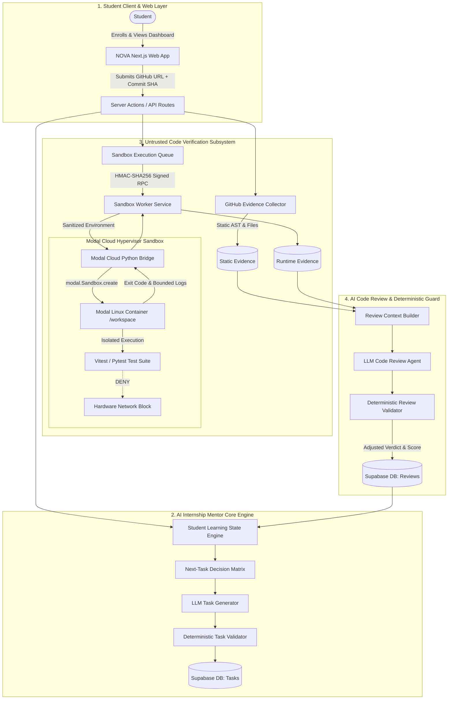
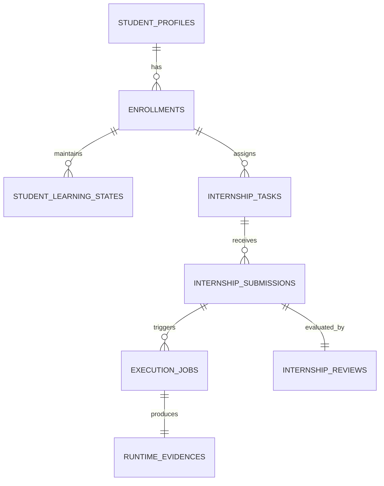
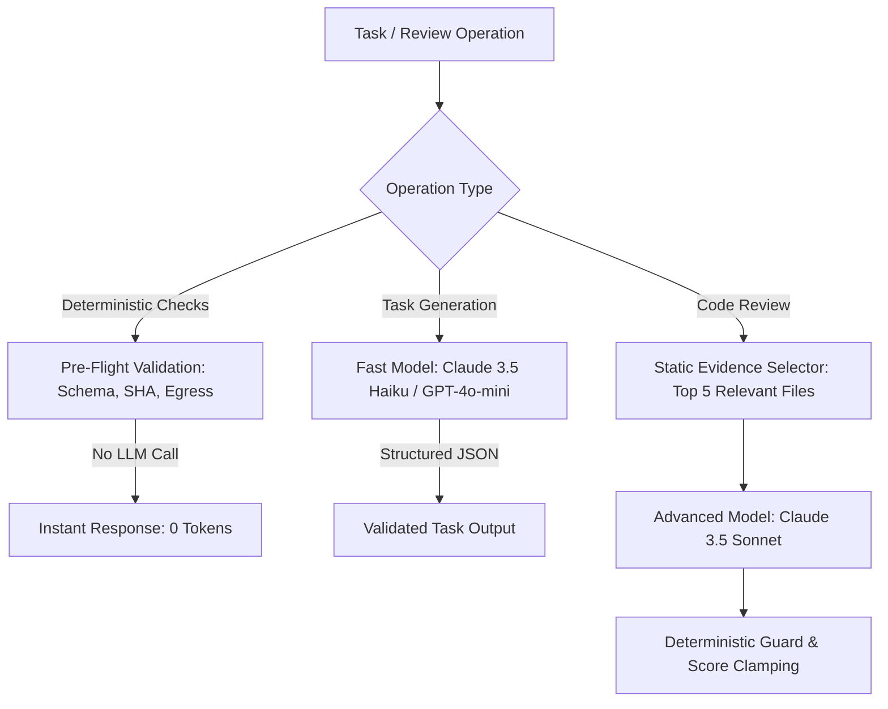

# NOVA — AI INTERNSHIP MENTOR: PHASE 4 ARCHITECTURE SPECIFICATION

**Document Version:** 1.0  
**Target:** AI Internship Mentor Core Engine & Production Sandbox Architecture  
**Author:** Antigravity Engineering Team  
**Date:** 2026-09-01  

---

## 1. Product Vision & Core Intelligence Model

NOVA is not a generic coding tutorial, a chatbot, or a simple test runner. **NOVA is an AI Engineering Mentor that delivers a true, high-stakes software engineering internship experience.**

```
+---------------------------------------------------------------------------------------------------+
|                                 THE CORE MENTOR INTELLIGENCE CYCLE                                |
|                                                                                                   |
|   INTERNSHIP ROLE       CURRICULUM          STUDENT STATE          TASK 1 (REAL WORK)             |
|   [Track & Domain] ---> [Milestones]  ---> [Skills & Gaps]  --->  [High-Context Assign]           |
|                                                                          |                        |
|                                                                          v                        |
|   NEXT TASK             STATE UPDATE         DETERMINISTIC GUARD      GITHUB & MODAL              |
|   [Scaffold / Adv] <--- [Proficiency] <---  [Review Validation] <---  [Runtime Evidence]          |
+---------------------------------------------------------------------------------------------------+
```

### The 17 Core Capabilities:
1. **Understand Role:** Understand the specific engineering role (Full-Stack, AI/ML, Cloud/DevOps, Data).
2. **Understand Business:** Ground every project in a simulated commercial product with real stakeholders.
3. **Build Curriculum:** Structure a progressive 4–8 milestone curriculum mapped to concrete deliverables.
4. **Understand Student Baseline:** Assess starting skill levels, education, and declared competencies.
5. **Generate Task 1:** Assign high-context, non-trivial engineering tasks matching the student's entry level.
6. **Observe Student Work:** Ingest student repositories, git commit history, and code changes.
7. **Review the Work:** Analyze static AST structures, architecture patterns, and factual test execution evidence.
8. **Identify Strengths & Weaknesses:** Track observed strengths, antipatterns, and missing edge cases.
9. **Decide Next Step:** Calculate pedagogical next steps (remediation, normal progress, advanced challenge).
10. **Generate Task 2:** Construct the next task dynamically conditioned on Attempt 1 review feedback.
11. **Increase Difficulty:** Automatically scale complexity when the student exhibits high velocity and quality.
12. **Provide Scaffolding:** Insert targeted hints, reference architectures, or smaller steps when struggling.
13. **Detect Repeated Errors:** Identify persistent antipatterns (e.g. unhandled nulls, missing schema validation).
14. **Deliver Actionable Feedback:** Provide senior-engineer quality code reviews with specific file line references.
15. **Capstone Traceability:** Ensure every individual task directly contributes code to the final capstone.
16. **Persistent State:** Maintain an immutable, longitudinal learning record across all attempts.
17. **Portfolio Graduation:** Deliver a recruiter-grade GitHub portfolio project with verified passing CI/CD.

---

## 2. System Architecture & End-to-End Pipeline



---

## 3. High-Quality Task Generation Standard (The 15 Mandatory Fields)

Every engineering task generated by NOVA must strictly conform to the 15-field standard. Generic educational tasks (e.g. "Read docs", "Learn React") are strictly rejected by the deterministic validator.

```typescript
export interface InternshipTask {
  // 1. Identification & Hierarchy
  id: string;
  milestone_index: number;
  
  // 2. Business & Engineering Context
  title: string;                                // Concise, professional task title
  business_context: string;                     // Commercial motivation and user impact
  role_responsibility: string;                  // Role-specific perspective (e.g. "Backend API Engineer")
  objective: string;                            // Concrete engineering objective
  
  // 3. Technical Requirements & Inputs
  technical_requirements: string[];             // Specific frameworks, libraries, constraints
  inputs: Array<{ name: string; type: string; description: string }>; // Schema/data inputs
  instructions: string[];                       // 4-6 step implementation roadmap
  
  // 4. Tangible Deliverables
  deliverables: string[];                       // Code files, test suites, configs, docs
  
  // 5. Verifiable Acceptance Criteria
  acceptance_criteria: string[];                // Testable conditions (endpoints, schemas, status codes)
  testing_requirements: {
    framework: string;                          // "vitest" | "jest" | "pytest"
    min_coverage_pct: number;                   // e.g. 80
    required_test_cases: string[];              // Specific edge cases to assert
  };
  documentation_requirements: string[];         // README updates, OpenAPI docstrings
  
  // 6. Pedagogical Metadata
  skills_practiced: string[];                   // Skills targeted
  estimated_hours: number;                      // 2 - 15 hours
  difficulty: "beginner" | "intermediate" | "advanced";
  reason_for_assignment: string;                // Pedagogical rationale linked to student history
  capstone_connection: string;                  // Direct contribution to final capstone project
}
```

---

## 4. Persistent Adaptive Student State Model

The student learning state is persisted and updated after every submission review:



### State Fields:
1. `student_id`: UUID reference to student.
2. `enrollment_id`: UUID reference to active enrollment.
3. `internship_id`: UUID reference to internship track.
4. `current_milestone_index`: Active milestone integer (0-based).
5. `completed_milestones`: Array of completed milestone indices.
6. `active_task_id`: Active task UUID or null.
7. `total_submissions_count`: Total attempts across all tasks.
8. `passed_submissions_count`: Total passed submissions.
9. `attempt_history`: Detailed history of attempts per task.
10. `skill_ratings`: Map of skill -> `{ observed_score, confidence_pct, last_tested_at }`.
11. `observed_strengths`: Array of verified technical competencies.
12. `observed_weaknesses`: Array of identified technical gaps.
13. `repeated_errors`: Tracked antipatterns occurring across >= 2 submissions.
14. `current_difficulty`: Current difficulty tier (`beginner`, `intermediate`, `advanced`).
15. `learning_velocity`: Ratio of first-attempt passes vs total tasks.
16. `average_review_score`: Cumulative score average (0-100).
17. `next_recommended_focus`: Pedagogical recommendation for next task.
18. `capstone_progress_pct`: Overall percentage completion of final portfolio project.

---

## 5. Next-Task Deterministic Decision Matrix

The Next-Task Decision Engine wraps LLM generation with strict pedagogical routing rules:

| Condition Trigger | Performance Signal | Decision Rule | Task Generation Constraint |
|---|---|---|---|
| **High Performance** | Attempt 1 Pass, Score >= 90%, Velocity > 0.8 | Advance & Increase Complexity | Set `difficulty = 'advanced'`, add performance/optimization requirement |
| **Normal Progress** | Score 75 - 89%, All Criteria Met | Advance to Next Milestone Task | Standard milestone task matching curriculum roadmap |
| **Needs Revision** | Score < 75% or Exit Code != 0 | Re-attempt Current Task | Retain task; inject specific validation errors & failing test feedback |
| **Struggling** | Attempt >= 3 or Score < 50% | Provide Scaffolding | Insert guided starter code, breakdown into smaller sub-deliverables |
| **Repeated Error** | Same antipattern in >= 2 tasks | Targeted Remediation Task | Focus task specifically on fixing the repeated error (e.g. error handling) |
| **Milestone Complete** | All milestone deliverables passed | Advance Milestone | Increment `current_milestone_index`, update capstone progress |
| **Capstone Ready** | All prerequisite milestones completed | Assign Capstone Project | Final integration, end-to-end testing, production packaging |

---

## 6. Real Code Execution Architecture (Modal Cloud Sandboxes)

Untrusted student code is isolated inside ephemeral Modal Cloud Linux containers:

```
[Student GitHub Repo]
        |
        v
[NOVA Application Server] ---> (Verifies Commit SHA & Signs Request via HMAC-SHA256)
        |
        v
[Sandbox Worker Service]
        |
        v
[Modal Python Bridge (modal_runner.py)]
        |
        v
[Modal Cloud Hypervisor Container]
  - Image: Debian Slim + Node 20 / Python 3.11 pre-baked with test frameworks
  - Workspace: /workspace (Mounted untrusted student files)
  - Network: block_network = True (100% Egress Blocked)
  - Memory: 512MB cgroup limit
  - CPU: 1.0 vCPU CFS scheduling quota
  - Timeout: 10 - 60s hard hypervisor kill
  - Environment: PATH, NODE_ENV=test, HOME=/workspace (Host env stripped)
        |
        v
[Captured Execution Evidence] ---> (exit_code, stdout, stderr, tests_summary, duration_ms)
```

---

## 7. AI Code Review & Anti-Hallucination Guardrails

The review pipeline guarantees that AI evaluations are strictly grounded in factual evidence:

```typescript
export function validateReview(
  review: InternshipReview,
  context: ValidationContext
): ValidationResult {
  const { runtimeEvidence, evidence } = context;

  // 1. Exit Code Truth Guard: If tests failed in cloud, AI CANNOT pass student
  if (runtimeEvidence && runtimeEvidence.exit_code !== 0) {
    if (review.verdict === "passed") {
      review.verdict = "needs_revision";
      review.score = Math.min(review.score, 65);
      review.summary = "[GUARD OVERRIDE] Automated test suite failed in cloud sandbox. " + review.summary;
    }
  }

  // 2. File Citation Grounding: Check that all cited files exist in static tree
  const validFiles = new Set(evidence.file_tree.map((f) => f.path.toLowerCase()));
  for (const criterion of review.criteria_results) {
    for (const file of criterion.evidence) {
      if (!validFiles.has(file.toLowerCase()) && !file.includes("README")) {
        criterion.status = "partially_met";
        criterion.reason += ` (Note: Cited file '${file}' was not found in repository).`;
      }
    }
  }

  // 3. Score Normalization: Ensure score aligns with criteria status
  const metCount = review.criteria_results.filter((c) => c.status === "met").length;
  const totalCount = review.criteria_results.length;
  const calculatedScore = totalCount > 0 ? Math.round((metCount / totalCount) * 100) : 50;
  
  if (review.verdict === "passed" && calculatedScore < 75) {
    review.verdict = "needs_revision";
  }

  return { valid: true, review, score: review.score };
}
```

---

## 8. Database Architecture & Readiness

The existing Supabase schema provides strong foundational tables with RLS policies:
- `internship_tasks` (Persisted tasks with JSONB deliverables & acceptance criteria)
- `internship_submissions` (Multi-attempt submissions with pinned `commit_sha`)
- `execution_jobs` (Sandbox execution job state machine)
- `runtime_evidences` (Factual execution records, exit codes, bounded logs)
- `internship_reviews` (Structured AI reviews with criteria results)

### Phase 4 Schema Extensions Required:
1. `student_learning_states`: Persistent longitudinal student state (skill confidence, weaknesses, repeated errors).
2. `enrollment_milestones`: Tracking completion timestamp and grade per milestone.

---

## 9. Cost Control, Token Efficiency & Multi-Model Tiering

To support thousands of concurrent students at minimal operational cost:



### Cost Optimization Rules:
1. **Evidence Compression:** `selectRelevantEvidence()` compresses 500KB repositories to <= 30KB of targeted AST snippets before LLM ingestion.
2. **Deterministic Pre-flight:** Blocked commits (SHA mismatch, syntax errors) are rejected before calling any LLM.
3. **Model Tiering:** Fast models (Haiku / 4o-mini) for task drafting; high-reasoning models (Sonnet) for multi-file code review.
4. **Idempotency Caching:** Identical `(submission_id, commit_sha)` tuples return cached runtime evidence.

---

## 10. Phase 4 Implementation Sequence

1. **Sprint 4.1 — Real GitHub Webhook & Git Ingestion:** Live GitHub App webhooks, OAuth repository access, and shallow git archive streaming.
2. **Sprint 4.2 — Adaptive Learning State Persistence:** Migration for `student_learning_states` and real-time state updater after every review.
3. **Sprint 4.3 — Next-Task Decision Engine:** Deterministic routing matrix integrating student history and milestone progression.
4. **Sprint 4.4 — Production Multi-Model Provider:** Live Anthropic / OpenAI integration with prompt compression and fallback safeguards.
5. **Sprint 4.5 — Student & Admin UI Integration:** Next.js student dashboard reflecting live task assignments, attempt histories, and verified capstone milestones.
