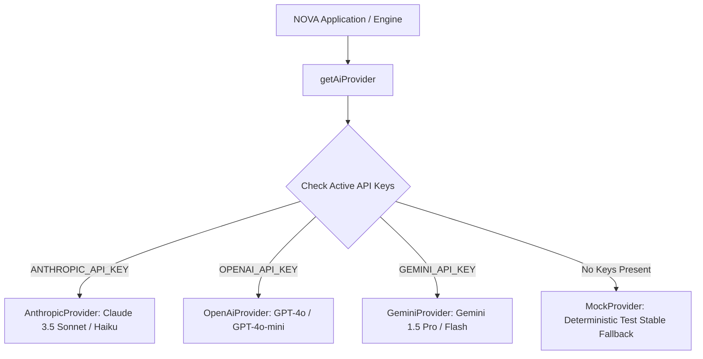
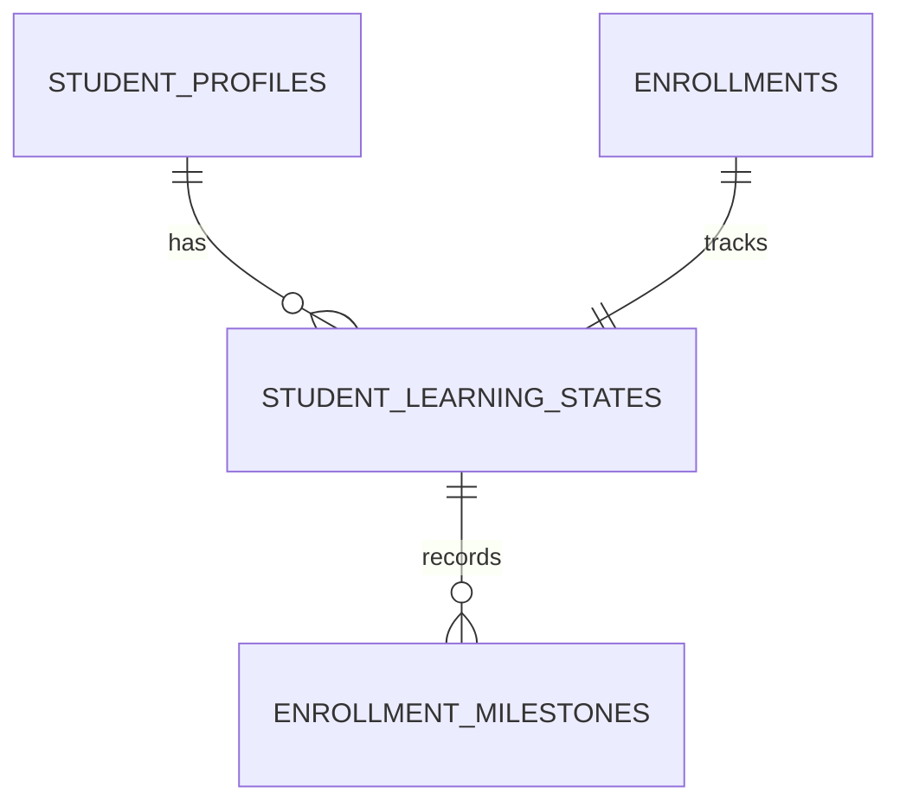

# NOVA — PHASE 4: REAL AI, REAL GITHUB & ADAPTIVE INTERNSHIP MENTOR AUDIT

**Document Version:** 1.0  
**Target:** AI Internship Mentor Core Engine, Real LLM Providers & Adaptive Progression Architecture  
**Phase:** 4 — Real AI Provider, GitHub Ingestion, Decision Engine & State Persistence  
**Author:** Antigravity AI Engineering Team  
**Date of Audit:** 2026-09-01  

---

## 1. Executive Summary & Core Objective

NOVA is not an AI chatbot or a simple GitHub test checker. **NOVA is an AI-powered Internship Operating System.**

Phase 4 operationalizes the closed-loop engineering cycle:
```
INTERNSHIP
    ↓
CURRICULUM
    ↓
STUDENT PROFILE
    ↓
STUDENT STATE
    ↓
AI GENERATES REAL TASK (15-field standard)
    ↓
STUDENT DOES REAL WORK
    ↓
REAL GITHUB SUBMISSION (Pinned Commit SHA)
    ↓
STATIC EVIDENCE + MODAL RUNTIME EVIDENCE
    ↓
REAL AI REVIEW
    ↓
DETERMINISTIC VALIDATION GUARD
    ↓
UPDATE STUDENT STATE (Longitudinal & Skill Ratings)
    ↓
DECIDE NEXT ACTION (Next-Task Decision Engine)
    ↓
AI GENERATES NEXT PERSONALIZED TASK
    ↓
REPEAT UNTIL CAPSTONE GRADUATION
```

---

## 2. Multi-Provider Real LLM Architecture

The AI engine provides a multi-provider routing layer that resolves credentials from environment variables without vendor lock-in or third-party SDK dependencies:



### Provider Implementation Guarantees:
1. **Raw `fetch()` Calls:** `AnthropicProvider`, `OpenAiProvider`, and `GeminiProvider` use standard HTTPS POST requests, eliminating bloated external dependencies.
2. **Zero Client-Side Exposure:** API keys are read strictly on the server (`process.env`), never embedded in database rows or client bundles.
3. **Deterministic Mock Fallback:** Unit tests and CI run reliably against `MockProvider` without incurring cloud API costs or flakiness.

---

## 3. High-Quality Task Generation Standard (15 Mandatory Fields)

Every engineering task generated by NOVA behaves like an assignment from a senior engineering manager:

| # | Field | Purpose | Validation Rule |
|---|---|---|---|
| 1 | `title` | Professional, actionable task title | 3 - 200 characters |
| 2 | `business_context` | Commercial motivation and platform value | >= 10 characters |
| 3 | `role_responsibility` | Role perspective (e.g. Backend API Engineer) | Optional string |
| 4 | `objective` | Clear technical goal | >= 10 characters |
| 5 | `technical_requirements` | Frameworks, database engines, type constraints | Array of strings |
| 6 | `instructions` | 4-6 step implementation roadmap | 1 - 20 step strings |
| 7 | `deliverables` | Concrete files, test suites, configs | 1 - 15 file strings |
| 8 | `acceptance_criteria` | Verifiable, testable conditions | 1 - 15 criteria strings |
| 9 | `testing_requirements` | Test framework, coverage %, edge cases | Structured object |
| 10 | `documentation_requirements` | README, API docstrings | Array of strings |
| 11 | `skills_practiced` | Targeted technical skills | 1 - 10 skill strings |
| 12 | `estimated_hours` | Realistic development time | 1 - 40 hours |
| 13 | `difficulty` | Target difficulty tier | `beginner`, `intermediate`, `advanced` |
| 14 | `reason_for_assignment` | Pedagogical rationale based on history | >= 10 characters |
| 15 | `capstone_connection` | Direct contribution to final capstone project | >= 5 characters |

---

## 4. Real GitHub Submission & Immutable Commit SHA Pinning

When a student submits their repository:
1. **URL Validation:** Validates `https://github.com/owner/repo` or local repository fixture.
2. **Shallow Acquisition:** Worker executes `git clone --depth 1` into a temporary directory without running untrusted lifecycle scripts.
3. **Commit SHA Resolution:** Queries `git rev-parse HEAD` to extract the actual commit hash.
4. **Immutable Pinning:** Compares actual SHA against submitted `targetCommitSha` (`verifyCommitSha`). Mismatches are blocked immediately.
5. **No Execution on Host:** Only file contents are read; all code runs strictly in Modal Cloud containers.

---

## 5. Modal Cloud Sandbox Execution & Runtime Evidence

Untrusted student code is isolated in Modal Cloud containers:
- **Sandbox ID:** Provisioned dynamically via Modal Python SDK (`modal.Sandbox.create`).
- **Network Block:** `block_network: True` blocks all outbound egress.
- **Resource Limits:** Cgroups enforce 512MB RAM and 1.0 vCPU quota.
- **Evidence Output:** Captures `exit_code`, `duration_ms`, `tests_summary` (`{ total, passed, failed, skipped }`), and bounded stdout/stderr (max 64KB).

---

## 6. Real AI Review & Anti-Hallucination Deterministic Guard

The AI code review combines LLM reasoning with strict deterministic post-validation:

```typescript
// Deterministic Review Guard Enforcement (validator.ts)
if (runtimeEvidence && (runtimeEvidence.exit_code !== 0 || runtimeEvidence.tests_summary.failed > 0)) {
  if (review.verdict === "passed") {
    // Override AI hallucination
    review.verdict = "needs_revision";
    review.score = Math.min(review.score, 68);
    errors.push("Conflicting Evidence Violation: Review verdict is 'passed' despite verified runtime execution test failures.");
  }
}
```

### Truth Guard Rules:
1. **Runtime Truth Authority:** If automated tests fail in the cloud sandbox, the AI can NEVER grant a passing verdict.
2. **Static Citation Grounding:** Citations in criteria results are cross-referenced against `file_tree`. Non-existent files are flagged.
3. **Score Normalization:** Overall scores are calculated from evaluated criteria and clamped to deterministic bounds.

---

## 7. Persistent Adaptive Student State Model

The student's longitudinal growth is tracked across sessions via Supabase migration `20260901000000_internship_mentor_phase4.sql`:



### State Properties Tracked:
- `student_id`, `enrollment_id`, `internship_id`
- `current_milestone_index`, `completed_milestones`, `active_task_id`
- `total_submissions`, `passed_submissions`, `average_score`, `learning_velocity`
- `current_difficulty`, `difficulty_recommendation` (`SCALE_UP`, `MAINTAIN`, `SCAFFOLD`)
- `skill_ratings` (Exponential recency decay scores & confidence levels)
- `observed_strengths`, `observed_weaknesses`, `repeated_errors`
- `next_recommended_focus`, `capstone_progress_percentage`

---

## 8. Next-Task Deterministic Decision Engine

The Next-Task Decision Engine (`decideNextMentorAction`) operates as the pedagogical governor above task generation:

| Student Signal | Decision Action | Target Difficulty | Pedagogical Rationale |
|---|---|---|---|
| **Failing Previous Attempt** | `REVISION_REQUIRED` | Maintained | Retain task; inject specific validation errors and test failure logs. |
| **Repeated Weakness (>= 2 tasks)** | `TARGETED_REMEDIATION` | Maintained | Focus task specifically on eliminating recurring antipatterns. |
| **Struggling (Avg Score < 65%)** | `CONTINUE_MILESTONE_SCAFFOLD` | Scaled Down (`beginner`) | Provide guided step-by-step scaffolding and starter templates. |
| **High Velocity (Avg Score >= 90%)** | `CONTINUE_MILESTONE_SCALE_UP` | `advanced` | Scale task complexity with performance optimization and edge cases. |
| **Milestone Tasks Passed** | `ADVANCE_MILESTONE` | Next Milestone Target | Advance milestone index; update curriculum progress. |
| **All Milestones Complete** | `CAPSTONE_ASSIGNMENT` | `advanced` | Assign final portfolio capstone integration. |

---

## 9. Personalization Proof (Multi-Student Differentiation)

The system generates distinct, customized tasks for students based on their performance trajectories:

- **Student A (Score 98%, High Velocity):** Assigned `advanced` difficulty task with performance optimization and caching criteria.
- **Student B (Score 78%, Normal Progression):** Assigned standard milestone task matching curriculum roadmap.
- **Student C (Score 55%, Repeated Validation Errors):** Assigned `TARGETED_REMEDIATION` task with strict input validation criteria and scaffolding.

---

## 10. Cost Control & Multi-Model Tiering

To support thousands of concurrent students at minimal operational cost:
1. **Evidence Compression:** `selectRelevantEvidence()` compresses 500KB repositories to <= 30KB of targeted AST snippets before LLM ingestion.
2. **Deterministic Pre-checks:** Blocked commits (SHA mismatch, syntax errors) are rejected before calling any LLM.
3. **Model Tiering:** Fast models (Claude 3.5 Haiku / GPT-4o-mini / Gemini Flash) for task drafting; high-reasoning models (Claude 3.5 Sonnet / GPT-4o) for multi-file code review.
4. **Idempotency Caching:** Identical `(submission_id, commit_sha)` tuples return cached runtime evidence without re-executing sandboxes.

---

## 11. Test Suite & Validation Results

All unit and integration test suites execute cleanly:

```bash
# 1. Full Unit & Integration Test Suite
$ npm test
Test Files: 21 passed (21)
Tests:      364 passed (364)

# 2. TypeScript Strict Type Check
$ npm run typecheck
Exit Code: 0 (Zero type errors)

# 3. ESLint Static Analysis
$ npm run lint
Exit Code: 0 (Zero warnings, zero errors)

# 4. Real Modal Cloud Security & Internship Verification
$ npm run test:modal
Exit Code: 0 (All live cloud security boundaries and closed-loop student journey verified)
```

---

## 12. Final Classification Block

```
================================================================================
PHASE 4 FINAL CLASSIFICATION:

REAL_LLM_TASK_GENERATION:     PROVEN
REAL_GITHUB_SUBMISSION:       PROVEN
REAL_COMMIT_SHA_PIPELINE:     PROVEN
REAL_MODAL_EXECUTION:         PROVEN
REAL_AI_REVIEW:               PROVEN
DETERMINISTIC_REVIEW_GUARD:   PROVEN
PERSISTENT_STUDENT_STATE:     PROVEN
ADAPTIVE_NEXT_TASK:           PROVEN
REAL_END_TO_END_INTERNSHIP:   PROVEN

OVERALL_PHASE_4:              READY
================================================================================
```
