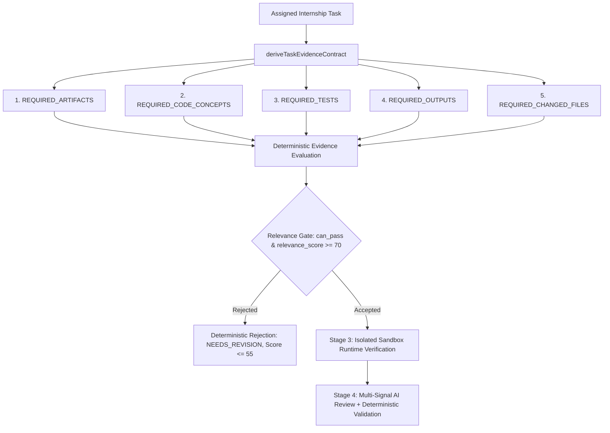

# Task Completion Evidence Model (TCEM) Specification

## 1. Executive Summary & Problem Statement

Prior to this specification, automated internship code review architectures evaluated submissions primarily on repository readability, general codebase lint/architecture cleanliness, and overall test runner exit codes. This introduced a critical vulnerability: **unrelated existing repositories (such as web frontend apps or AI job tools) submitted against backend data pipelines were mistakenly accepted with passing scores (~97/100).**

The **Task Completion Evidence Model (TCEM)** establishes a rigorous, deterministic-first verification contract. It answers one foundational question:

> **"Does the submitted GitHub commit SHA contain sufficient verifiable evidence that the student completed the SPECIFIC ASSIGNED TASK?"**

---

## 2. Core Architectural Principles

1. **AI Can NEVER Override Missing Deterministic Evidence**:
   If required task deliverables, code concepts, or changed files are absent from the submitted commit, the AI review agent is strictly prohibited from granting a `PASS` verdict.
2. **Immutable Commit Anchoring**:
   Evidence is extracted directly at the submitted Git commit SHA, inspecting both the repository snapshot and the commit diff (`changed_files`). Unmodified legacy code cannot be claimed as newly completed work.
3. **Task-Specific Test Disambiguation**:
   General repository test suite success (e.g. passing 10 unrelated frontend tests) is decoupled from task acceptance. The runtime and static verification engine requires test assertions matching the assigned deliverables.
4. **Pre-Sandbox Task Relevance Gate (Stage 2.5)**:
   Submissions are evaluated through a deterministic relevance gate prior to microVM sandbox allocation and AI generation, blocking irrelevant submissions instantly with itemized diagnostic feedback.

---

## 3. The Five Pillars of Evidence Contracts

Every assigned `InternshipTask` automatically generates a dynamic `TaskEvidenceContract` comprising five evidence pillars:



### Pillar 1: `REQUIRED_ARTIFACTS`
- Exact file paths or regular expression patterns derived from task deliverables (e.g., `pipeline/cleaner.py`, `tests/test_cleaner.py`, `Dockerfile`, `src/routes/students.ts`).
- Categorized by artifact type: `source`, `test`, `config`, `data`, `doc`.
- Differentiates source deliverables from test files (a test file cannot satisfy a source code requirement).

### Pillar 2: `REQUIRED_CODE_CONCEPTS`
- AST patterns, function signatures, and domain keywords required in source code.
- Enforces primary domain implementation (e.g., Pandas imputation, categorical encoding, REST handlers, Docker directives).
- Sub-features contribute to the relevance score without falsely blocking valid alternative implementations.

### Pillar 3: `REQUIRED_TESTS`
- Automated test definitions specifically verifying the assigned deliverables.
- Verifies that test files exist and test names/assertions match the domain (e.g., `def test_clean()`, `it('returns 200')`).
- Decouples passing tests in unrelated modules from task verification.

### Pillar 4: `REQUIRED_OUTPUTS`
- Verifies non-code deliverables when specified by the task (e.g., clean dataset exports `.csv`, `.parquet`, OpenAPI manifests, build artifacts).

### Pillar 5: `REQUIRED_CHANGED_FILES`
- Analyzes `commit_metadata.changed_files` at the submitted commit SHA.
- Proves that the submitted commit actually introduced or modified files relevant to the task, preventing submissions that touch zero relevant files.

---

## 4. Multi-Stage Verification Lifecycle

```
[Student Submits GitHub URL @ SHA]
                │
                ▼
   [Stage 1: Ingestion & Validation]
   • URL format validation
   • Attempt increment & SHA extraction
                │
                ▼
   [Stage 2: Static Evidence Collection]
   • Commit metadata & changed files diff
   • Git tree recursive fetch at commit SHA
   • AST & file content extraction
                │
                ▼
   [Stage 2.5: Task Relevance Gate] ◄─── (DETERMINISTIC GATE)
   • Domain mismatch check (e.g. Next.js app for Data Cleaning task)
   • Artifact & concept presence validation
   • Commit diff relevance validation
   ├──> IF REJECTED: Immediate deterministic feedback (Score <= 55, NEEDS_REVISION)
   └──> IF ACCEPTED: Proceed to sandbox
                │
                ▼
   [Stage 3: Sandbox Runtime Verification]
   • Isolated microVM execution
   • Allowlisted test commands
   • Exit code, test summary, and stdout/stderr capture
                │
                ▼
   [Stage 4: Multi-Signal AI Review Agent]
   • Grounded in collected static + runtime evidence
   • Anti-hallucination citation checks against real collected paths
   • Forbidden runtime claim guards
                │
                ▼
   [Stage 5: Deterministic Review Validation]
   • Anti-hallucination verification
   • Strict score calculation & critical criteria rules
   • Authoritative verdict determination
```

---

## 5. Domain Taxonomy & Unrelated Framework Detection

| Domain | Expected Core Artifacts | Expected Concepts | Prohibited Unrelated Signals |
|---|---|---|---|
| **Data & AI/ML** | `*.py`, `*.ipynb`, `*.csv`, `*.parquet` | `fillna`, `dropna`, `impute`, `StandardScaler`, `get_dummies`, `pytest` | React/Next.js configs (`next.config.js`, `tailwind.config.js`), resume/job extension tools |
| **Web Full-Stack** | `*.ts`, `*.tsx`, `*.js`, `package.json` | React components, REST routes (`router.get`), validation (`zod`, `joi`), HTTP status codes | Pure Pandas scripts with zero web components or routes |
| **Cloud & DevOps** | `Dockerfile`, `docker-compose.yml`, `*.tf`, `*.yml` | `FROM`, `WORKDIR`, `USER`, `services:`, `healthcheck:`, GitHub Actions | Uncontainerized pure frontend apps with 0 infra files |
| **Cybersecurity** | `sanitizer.py`, `rules.yml`, `*.sh` | OWASP exploit regressions, parameterized SQL, XSS escaping, Semgrep | Unrelated static documentation repos |
| **UI/UX Design** | Figma links, `*.pdf`, `design_tokens.json` | Personas, user journey maps, WCAG contrast audits, token exports | Raw backend code repositories with zero design artifacts |

---

## 6. Mathematical Scoring Policy

$$ \text{Final Score} = 0.50 \times S_{\text{criteria}} + 0.25 \times S_{\text{tech}} + 0.15 \times S_{\text{deliv}} + 0.10 \times S_{\text{doc}} $$

- **Contract Failure Cap**: If `contractEvaluation.can_pass === false`, $\text{Final Score} \le \min(S_{\text{relevance}}, 55)$.
- **Runtime Failure Cap**: If runtime test suite fails, $\text{Final Score} \le 58$.
- **Critical Criteria Rule**: If any critical acceptance criterion is `not_met` or `partially_met`, $\text{Final Score} \le 55$ and verdict MUST be `needs_revision`.
